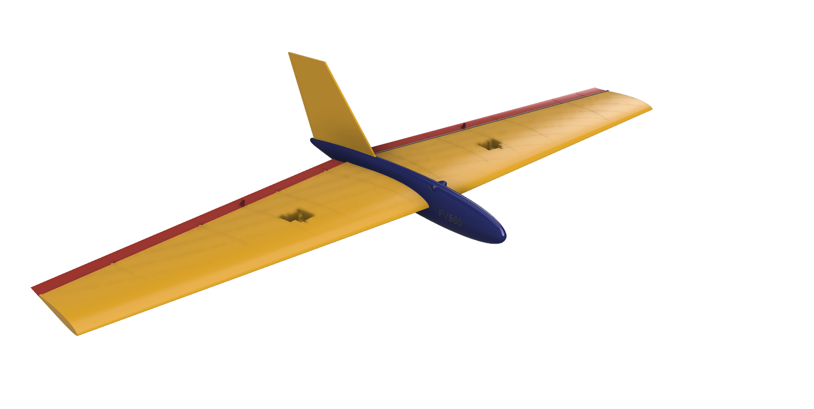
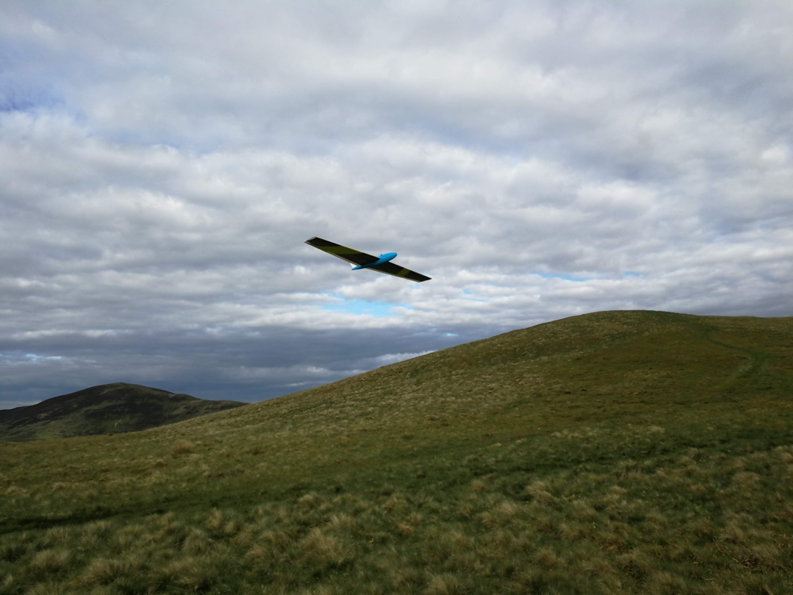
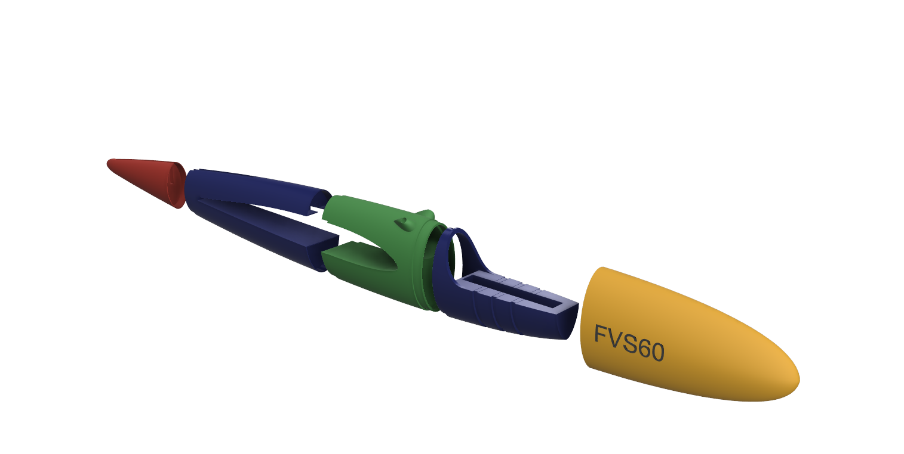
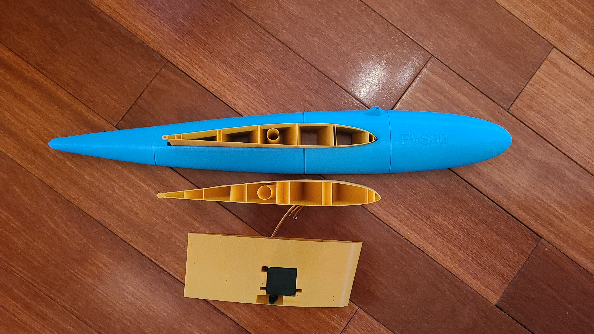

# FVS60

Design files for the FVS60, a 3D printed 60-inch class flying wing for the slope

# Background

Slope soaring is long established discipline of aeromodelling. Slope soaring gliders use the lift from upwardly moving air on the front face of hillsides. Flying wings are convenient to carry up the hill, straightforward to launch and land, as well as being fun to fly. Not all flying wings are created equal, however. The FVS60 emerged from discussions of the [Forth Valley Soarers](http://www.forthvalleysoarers.org.uk/) lamenting the lack of availability of some of our favourite designs.

## Prototype (hybrid)

The prototype is a hybrid with a 3D printed fuselage (PLA+ from eSun) with a foam-cut EPS wing (by Mike Chantler, who also suggested the MH-45 profile). The foam is stiffened with carbon fibre and laminating film. It was fitted with standard servos, a 4-cell AA battery pack. We liked it, and expect to build more. The STL and slicer files are in [./print](./print).

### 3D printed fuselage

The fuse is printed in five pieces. The four pieces are glued together, while the cone is taped on each flight. Note that you should not launch by gripping the cone, else the cone launches forwards while the model drops at your feet. Ask Mike how we know :-).

There is cable routing from the top middle of the wing through to the front of the fuse for the servo wires, and "Rhino" bumps for antenna wires. The grooves in the tray are for cable ties to hold the battery pack. Use the battery pack as far forward as you can to get the CofG in the right place. There is some scope for exploration here - make it similar to your other flying wings. If this is your first flying wing, then it is (from memory) approx 2.5 inch from the leading edge. You can get an idea by spinning in a circle holding one wing end, and see whether it feels right / tracks ok.

### Foam wings

The foam wings were CNC cut using the MH-45 profile to the [plan](./doc/plan.pdf).

### 3D printed wings

The 3D-printed wing has not been fully printed - although test pieces are promising (except for some warping).

## Design files

The design of the fuselage is the same for Mk2 and Mk3. You can see different trays in the [design files](./3d/fvs60-mk3.f3z) (Autodesk Fusion 360). The design has also been exported as an [STL](./3d/fvs60-mk3.stl) in case you do not have access to proprietary CAD software. Unfortunately, this design was too complex to undertake in the open-source CAD tools that I was aware of at the time.

## Contribution

If you work on printing the 3D wings, adding different fuselage trays, improving the tail etc, then please consider submitting a [pull request(PR)](https://docs.github.com/en/pull-requests/collaborating-with-pull-requests/proposing-changes-to-your-work-with-pull-requests/creating-a-pull-request).

### Support

There is no support for this project - the files are offered in the hope that they are of some help to you in printing fuselages to combine with foam wings, or getting a head start in exploring the design of 3D printed wings. 

### Help - I don't have a 3D printer 

I got some quotes for the cost of getting these made at a commercial 3D printing house and each fuselage copy would cost nearly as much as just buying a decent entry level printer. That's understandable given the overheads of offering a "guaranteed quality" print service for a set of objects taking just under three working days to print on a single printer. However, as an aeromodeller you will always want more than one of a good thing, so I'd recommend buying a printer and learning to print. 

If you wish to offer prints of this design to others - let me know and I can include your details here. 

The design fits into the build area of a standard entry-level 3D printer like the Ender 3 v2 Pro (220 mm x 220 mm x 250 mm) or the more expensive Prusa Mk3s (210 mm x 210 mm x 250 mm).

### Other Builds

If you build one, consider submitting an image for display here (by email, or by PR).

## License

This is intended to be open source hardware that comes with no warranty, express or implied, and no liability (e.g. for how good the design is). Feel free to share as you would GPL software, especially if you make modifications. Also, it's ok to charge for printing costs if you make this design for other people (it costs you time, and money to do that), but not to re-sell the designs or derivatives (beyond a resonable charge for postage and packing if sending in hard copy - if anyone still does that these days). 

## Flying

If you are new to flying, please consult your national aeromodelling organisation for advice on safety and legal matters - such as the [BMFA](https://bmfa.org/) in the UK and  - chances are, you live somewhere that tightly regulates who can fly, even for slope soaring. No liability accepted or warranty given, whether implied or express etc etc. Fly safe!
